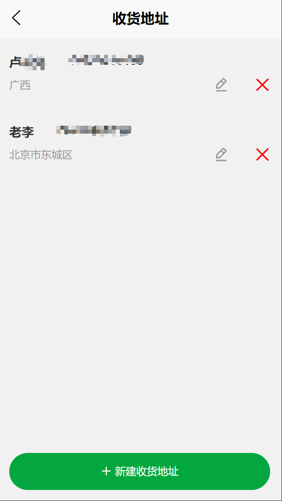

# 垃圾回收精灵-微信小程序

### 软件介绍
- 用于回收和分类垃圾的微信小程序

### 软件开发环境
* java8
* Springboot 2.1.6 + mysql + redis 

### 开发工具

* IntelliJ IDEA
* HBuilderX
* Navicat
* 微信开发者工具
* Another Redis Desktop Manager

### 出现的问题：

项目运行后，你会发现图片没有加载，那是因为我们把图片都放在了阿里云的OSS上，可能是没钱了，所以无法加载，在根目录的frontend/static文件夹里面有那些图片，但需要你自己一个一个把项目中的图片地址替换，会有点麻烦。

### 功能

* 注册/登录页面

 

* 主页

 

* 分类

  

* 预约回收

  

* 挑战赛

 

* 个人页面

 
   

